# 데이터 모델과 삭제 정책

## 설계 기준

- 모든 내부 기본 키는 `bigint` 자동 생성 값으로 관리한다.
- 외부 시스템에서 온 UUID·문자열 식별값은 `legacy_key`로 보존하고, 기본 키로 사용하지 않는다.
- `app_document.document_key`는 조회 목적의 업무 키이며 `unique` 제약으로 유지한다.
- 모든 애플리케이션 테이블은 단수형 이름을 사용한다.
- 예약어 또는 예약어와 혼동하기 쉬운 이름은 테이블·컬럼명으로 사용하지 않는다.

## ERD

```mermaid
erDiagram
    APP_DOCUMENT {
        bigint id PK
        text document_key UK
        text lifecycle_state
    }
    AUTOMATION_KEYWORD {
        bigint id PK
        text lifecycle_state
    }
    AUTOMATION_CONTENT {
        bigint id PK
        uuid legacy_key UK
        text lifecycle_state
    }
    AUTOMATION_POSTING_RECORD {
        bigint id PK
        bigint content_id FK
        uuid content_legacy_key
        text lifecycle_state
    }
    TASK {
        bigint id PK
        text status
        text lifecycle_state
    }
    CONTENT_PACKAGE {
        bigint id PK
        text legacy_key UK
        text lifecycle_state
    }
    CONTENT_OUTPUT {
        bigint id PK
        bigint package_id FK
        text package_legacy_key
        text lifecycle_state
    }
    APPROVAL {
        bigint id PK
        text legacy_key UK
        text lifecycle_state
    }
    AI_NEWS_ITEM {
        bigint id PK
        text legacy_key UK
        text lifecycle_state
    }
    AI_NEWS_BRIEFING {
        bigint id PK
        uuid legacy_key UK
        text lifecycle_state
    }
    AI_OPERATION_RUN {
        bigint id PK
        text legacy_key UK
        text lifecycle_state
    }
    AUTOMATION_RUN {
        bigint id PK
        text legacy_key UK
        text lifecycle_state
    }
    DASHBOARD_KPI {
        bigint id PK
        smallint legacy_key UK
        text lifecycle_state
    }

    AUTOMATION_CONTENT ||--o{ AUTOMATION_POSTING_RECORD : "content_id"
    CONTENT_PACKAGE ||--o{ CONTENT_OUTPUT : "package_id"
```

## 소프트 삭제 정책

모든 테이블에는 아래 컬럼을 둡니다.

| 컬럼 | 의미 |
|---|---|
| `lifecycle_state` | `active` 또는 `removed` |
| `removed_at` | 제거 처리 시각. 활성 행이면 `null` |

- 일반 조회·수정은 `lifecycle_state = 'active'` 행만 대상으로 합니다.
- 삭제 API는 `delete` SQL을 사용하지 않고 `lifecycle_state = 'removed'`, `removed_at = now()`로 변경합니다.
- 업무 진행 상태인 `task.status`와 삭제 상태인 `task.lifecycle_state`는 별개입니다.
- 상위 데이터가 제거돼도 하위 데이터는 자동 물리 삭제하지 않습니다. 복구·감사 목적을 위해 관계와 기록을 유지합니다.
- 관리자 복구 기능이 필요해지면 `lifecycle_state`를 다시 `active`로 바꾸고 `removed_at`을 `null`로 처리합니다.
